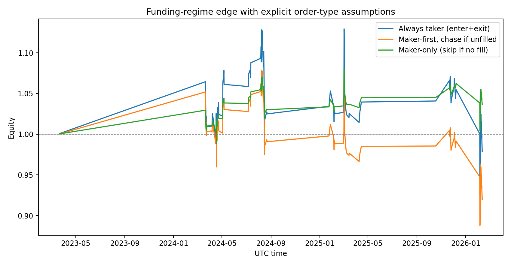
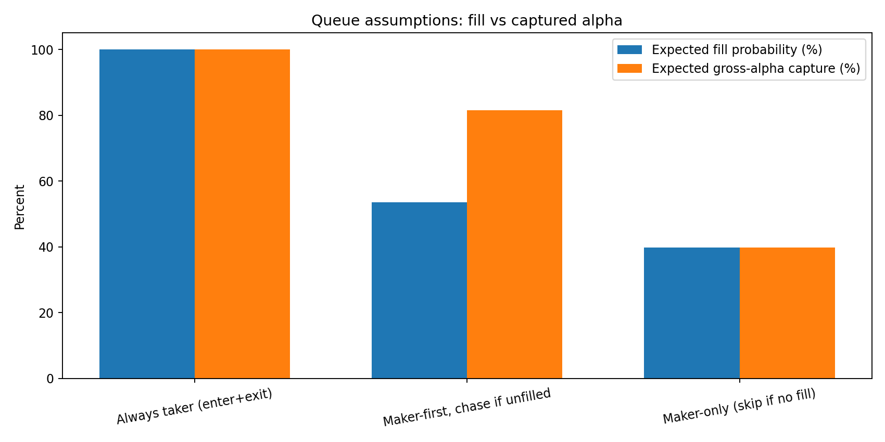

# Day 18: Maker vs Taker Isn’t a Fee Toggle

Yesterday’s key result was: **the funding-regime edge is fragile once execution gets realistic**.

Today I went one layer deeper.

Instead of saying “85% fill” as a fixed knob, I modeled a simple **maker/taker queue process** where fill probability is linked to volatility, quote distance, and queue priority.

---

## Setup (same signal, stricter execution model)

I kept the same strategy and OOS protocol as Day 17:

- Instrument: **BTCUSDT perpetual (Binance)**
- Frequency: **8h**
- Sample: **2022-01-01 → 2026-03-03**
- OOS protocol: **expanding yearly walk-forward** (test years 2023–2026)
- Signal:

$$
z_t = \frac{f_t - \mu_t^{(90)}}{\sigma_t^{(90)}},\quad
\text{long if } z_t < -1.0 \text{ and } \text{RV}_t^{(21)} > Q_{0.75}(\text{RV})
$$

I got **117 OOS trades** (same order of magnitude as yesterday).

Raw gross return definition (before execution):

$$
g_{t+1} = \frac{P_{t+1}}{P_t} - 1 - f_{t+1}
$$

---

## Explicit queue-fill proxy

For maker modes, I modeled expected fill probability as:

$$
\text{touchProb}_t = \min\left(1, \frac{0.5\,R_{t+1}\sqrt{\tau/480}}{\delta}\right),
\qquad
p^{\text{fill}}_t = \text{touchProb}_t \cdot q
$$

Where:

- \(R_{t+1} = (H_{t+1}-L_{t+1})/O_{t+1}\) is next-bar range,
- \(\tau\) = order lifetime (minutes),
- \(\delta\) = quote distance from touch,
- \(q\) = queue-priority factor.

This is still a proxy (not L2 order book replay), but better than a fixed global fill ratio.

---

## Scenarios tested

1. **Always taker (enter+exit)**
   - 10 bps roundtrip cost, small latency penalty
2. **Maker-first, chase if unfilled**
   - maker+taker if filled; otherwise chase as taker
   - unfilled branch captures only 60% of gross move
3. **Maker-only passive**
   - maker+maker costs, but skip trade entirely if no fill

For confidence, I kept **stationary bootstrap** (5,000 resamples, expected block length = 5 trades).

---

## Results

### Equity outcome



### Fill/capture trade-off



### Summary table

| Scenario | Avg bps/trade | Win rate | Final equity | Avg fill prob | Avg gross capture |
|---|---:|---:|---:|---:|---:|
| Always taker | +0.24 | 49.6% | 0.979x | 100.0% | 100.0% |
| Maker-first, then chase | -5.75 | 47.9% | 0.920x | 53.6% | 81.4% |
| Maker-only passive | +3.45 | 50.4% | 1.036x | 39.8% | 39.8% |

### Stationary-bootstrap 95% CI (mean bps/trade)

- **Always taker:** \([-28.36, +28.60]\), \(P(\mu>0)=51.3\%\)
- **Maker-first/chase:** \([-30.52, +17.13]\), \(P(\mu>0)=32.4\%\)
- **Maker-only passive:** \([-8.77, +15.16]\), \(P(\mu>0)=72.7\%\)

---

## Honest interpretation

1. **Maker-only “looks best” only because it trades much less.**
   - It captures ~40% of gross alpha and skips ~60% of opportunities.
   - Lower cost helps, but opportunity loss is massive.

2. **Chasing missed maker fills is expensive.**
   - Once you add delayed-entry alpha decay + taker fallback costs, expectancy turns negative.

3. **Still not statistically decisive.**
   - Every CI still overlaps zero.
   - This remains a research candidate, not a scale-up signal.

---

## Reproducibility

In this folder:

- `analyze_maker_taker_queue.py`
- `day18-maker-taker-queue-results.json`
- `day18-queue-equity-curves.png`
- `day18-fill-capture-bars.png`

Run:

```bash
python3 blog/posts/2026-03-03-maker-taker-queue/analyze_maker_taker_queue.py
```

---

## Next step

The right next test is now obvious:

> Replace range-based fill proxies with **venue-specific microstructure assumptions** (or full L2 replay where possible), then run the same walk-forward + bootstrap stack across venues.

Until then: no aggressive sizing.

---

## References

- Politis, D.N. & Romano, J.P. (1994), *The Stationary Bootstrap*: https://www.tandfonline.com/doi/abs/10.1080/01621459.1994.10476870
- Practical primer on stationary bootstrap: https://blogs.sas.com/content/iml/2021/01/20/stationary-bootstrap-sas.html
- Execution-cost modeling overview: https://www.quantstart.com/articles/Successful-Backtesting-of-Algorithmic-Trading-Strategies-Part-II/

*Research only. Not financial advice.*
