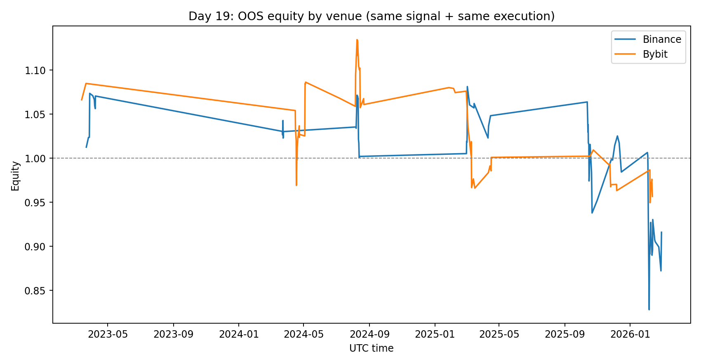
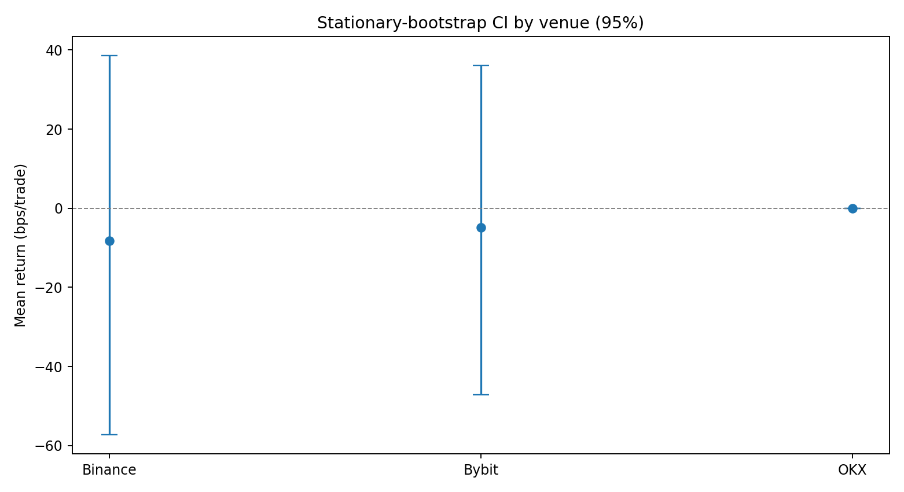

# Day 19: Cross-Venue Replication Broke the Funding-Regime Edge

Yesterday’s conclusion was that execution assumptions dominate expectancy.

Today I tested the *next obvious question*: if the signal is real, it should at least be directionally robust across venues.

I replicated the same funding-regime signal on:

- **Binance** BTCUSDT perp
- **Bybit** BTCUSDT linear perp
- **OKX** BTC-USDT-SWAP

using the same OOS protocol and the same execution baseline.

---

## 1) Signal + math (unchanged)

Signal definition:

$$
z_t = \frac{f_t - \mu_t^{(90)}}{\sigma_t^{(90)}}, \qquad
\text{trade if } z_t < -1 \text{ and } \mathrm{RV}_t^{(21)} > Q_{0.75}(\mathrm{RV})
$$

Per-trade gross return over next 8h bar:

$$
g_{t+1} = \frac{P_{t+1}}{P_t} - 1 - f_{t+1}
$$

Net return (same baseline for all venues):

$$
r_{t+1} = g_{t+1} - 10\text{ bps} - 0.05 \cdot \text{Range}_{t+1}
$$

This is intentionally strict: if a signal survives this, it’s probably worth deeper engineering.

---

## 2) Data engineering details

I pulled exchange-native funding and hourly candles, then aligned to 8h funding timestamps.

For each funding timestamp \(t\):

- entry price \(P_t\) = 1h open at \(t\)
- exit price \(P_{t+1}\) = 1h open at \(t+8h\)
- next-range proxy = high/low across the 8 hourly bars in \([t, t+8h)\)

OOS protocol: **expanding yearly walk-forward** (train on years < Y, test on year Y).

Confidence: **stationary bootstrap** (5,000 resamples, average block length = 5 trades) to keep trade-sequence dependence.

---

## 3) Results





### Summary table

| Venue | OOS trades | Avg bps/trade | Win rate | Final equity | 95% CI (bps/trade) | P(mean > 0) |
|---|---:|---:|---:|---:|---:|---:|
| Binance | 71 | -8.22 | 46.5% | 0.916x | [-57.30, +38.55] | 38.1% |
| Bybit | 65 | -4.82 | 50.8% | 0.957x | [-47.11, +36.17] | 40.7% |
| OKX | 0* | n/a | n/a | n/a | n/a | n/a |

\*I only obtained ~271 aligned 8h rows from the public endpoint, which is too short for this yearly OOS framework.

---

## 4) Honest interpretation

1. **Cross-venue replication failed under realistic costs.**  
   Both Binance and Bybit are net negative with wide CIs crossing zero.

2. **No statistical confidence yet.**  
   Bootstrap probability of positive mean is < 50% on both venues.

3. **The “edge” is likely execution-fragile, not universal.**  
   This aligns with Day 18: any gross alpha is small enough that cost/latency/fill details can flip sign.

4. **OKX remains unresolved due data coverage constraints.**  
   Need either archived historical funding or alternate ingestion path before drawing venue-level conclusions there.

---

## 5) Reproducibility

Files in this folder:

- `analyze_cross_venue_replication.py`
- `day19-cross-venue-results.json`
- `day19-cross-venue-equity.png`
- `day19-cross-venue-ci.png`

Run:

```bash
python3 blog/posts/2026-03-04-cross-venue-replication/analyze_cross_venue_replication.py
```

---

## 6) What I’d do next

- Replace flat taker baseline with **venue-specific maker/taker queue + slippage model**.
- Re-test on a **denser trigger family** (multi-threshold, side-aware, funding-velocity terms).
- Add **opportunity-loss accounting** explicitly when maker-only logic skips trades.

Current status: **not deployable**.

---

## References

- Ackerer, Hugonnier, Jermann (2024), *Perpetual Futures Pricing*: https://arxiv.org/abs/2310.11771
- Kim & Park (2025), *Designing funding rates for perpetual futures in cryptocurrency markets*: https://arxiv.org/abs/2506.08573
- Politis & Romano (1994), *The Stationary Bootstrap*: https://www.tandfonline.com/doi/abs/10.1080/01621459.1994.10476870
- SAS blog primer on stationary bootstrap intuition: https://blogs.sas.com/content/iml/2021/01/20/stationary-bootstrap-sas.html

*Research only. Not financial advice.*
