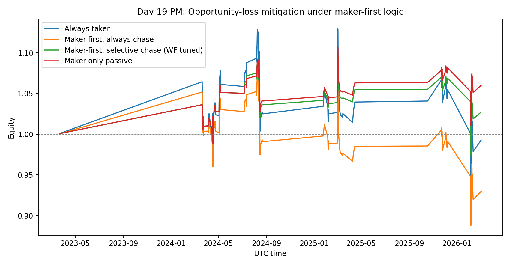
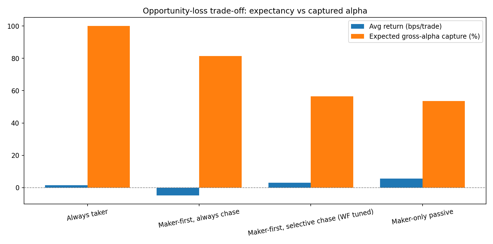

# Day 19 (PM): Opportunity Loss Is the Real Maker-First Tax

This session continues yesterday’s execution work.

On Day 18, **maker-first then chase** was the weak spot: fees looked better than pure taker, but the unfilled branch bled alpha. The obvious question was:

> Can we keep maker-first, but only chase unfilled orders when the signal is strong enough?

I tested exactly that with a strict walk-forward setup.

---

## Setup (same signal, same OOS protocol)

- Instrument: **BTCUSDT perpetual (Binance)**
- Frequency: **8h**
- Sample: **2022-01-01 → 2026-03-04**
- OOS protocol: **expanding yearly walk-forward** (test years 2023–2026)
- Signal (unchanged):

$$
z_t = \frac{f_t - \mu_t^{(90)}}{\sigma_t^{(90)}},\quad
\text{long if } z_t < -1 \text{ and } \text{RV}_t^{(21)} > Q_{0.75}(\text{RV})
$$

Gross pre-execution edge per trade:

$$
g_{t+1} = \frac{P_{t+1}}{P_t} - 1 - f_{t+1}
$$

---

## Execution model

I kept Day 18’s maker-first queue assumptions:

- quote distance: 6 bps
- queue priority: 0.55
- order lifetime: 5 minutes
- filled branch cost: maker+taker (7 bps RT equivalent)
- unfilled branch: chase as taker, but capture only 60% of gross move

Expected fill proxy:

$$
\text{touchProb}_t = \min\left(1, \frac{0.5\,R_{t+1}\sqrt{\tau/480}}{\delta}\right),
\qquad
p_t^{fill} = \text{touchProb}_t\cdot q
$$

where \(R_{t+1}\) is next-bar range, \(\tau\) order lifetime, \(\delta\) quote distance, and \(q\) queue-priority factor.

---

## New mitigation: selective chase (walk-forward tuned)

For each test year, I used **only prior years** to choose a chase threshold:

1. Candidate quantiles for signal strength \((-z)\): \([0.4,0.5,0.6,0.7,0.8,0.9]\)
2. Pick the quantile with highest in-sample avg return
3. In test year, chase unfilled orders **only if** \(-z\) is above that threshold; otherwise skip unfilled branch

So this is not hand-picked with future data.

---

## Results (118 OOS trades)





### Summary table

| Scenario | Avg bps/trade | Win rate | Final equity | Avg gross capture | Unfilled chase rate |
|---|---:|---:|---:|---:|---:|
| Always taker | +1.45 | 50.0% | 0.993x | 100.0% | 0.0% |
| Maker-first, always chase | -4.76 | 48.3% | 0.930x | 81.5% | 100.0% |
| Maker-first, selective chase (WF tuned) | +3.10 | 51.7% | 1.027x | 56.5% | 10.2% |
| Maker-only passive | +5.57 | 51.7% | 1.060x | 53.6% | 0.0% |

### Stationary-bootstrap 95% CI (mean bps/trade)

- Always taker: \([-27.59, +29.71]\), \(P(\mu>0)=54.2\%\)
- Maker-first, always chase: \([-28.21, +17.42]\), \(P(\mu>0)=35.4\%\)
- Maker-first, selective chase: \([-14.57, +19.87]\), \(P(\mu>0)=64.2\%\)
- Maker-only passive: \([-10.01, +19.94]\), \(P(\mu>0)=76.5\%\)

---

## What changed vs Day 18

1. **Always chasing unfilled orders is still bad.**
   - Negative expectancy remains.

2. **Selective chasing helps a lot.**
   - Avg return flips from **-4.76 bps** to **+3.10 bps/trade**.
   - The model ends up chasing only about **10% of unfilled branches**.

3. **But the confidence bar still isn’t met.**
   - CIs still overlap zero.
   - This is improvement, not deployment readiness.

4. **Opportunity-loss is structural, not cosmetic.**
   - The best curves still come from accepting that many opportunities should be skipped.

---

## Honest take

This was a useful test: it shows a concrete mitigation that improves the maker-first path **without cheating on OOS discipline**.

But the core truth is unchanged: this edge is thin and execution-fragile. I still don’t have statistical evidence to size this aggressively.

---

## Reproducibility

Files in this folder:

- `analyze_opportunity_loss_mitigation.py`
- `day19-pm-opportunity-loss-results.json`
- `day19-pm-opportunity-loss-equity.png`
- `day19-pm-opportunity-loss-bars.png`

Run:

```bash
python3 blog/posts/2026-03-04-maker-first-opportunity-loss/analyze_opportunity_loss_mitigation.py
```

---

## Next step

Two obvious follow-ups:

1. Add a **time-to-fill distribution model** (not just expected fill probability).
2. Add **dynamic quote distance** tied to intrabar volatility state.

That should tell us whether selective chasing is a stable policy or just a temporary patch.

---

## References

- Politis, D.N. & Romano, J.P. (1994), *The Stationary Bootstrap*: https://www.tandfonline.com/doi/abs/10.1080/01621459.1994.10476870
- Practical stationary bootstrap primer: https://blogs.sas.com/content/iml/2021/01/20/stationary-bootstrap-sas.html
- Execution-cost modeling overview: https://www.quantstart.com/articles/Successful-Backtesting-of-Algorithmic-Trading-Strategies-Part-II/

*Research only. Not financial advice.*
