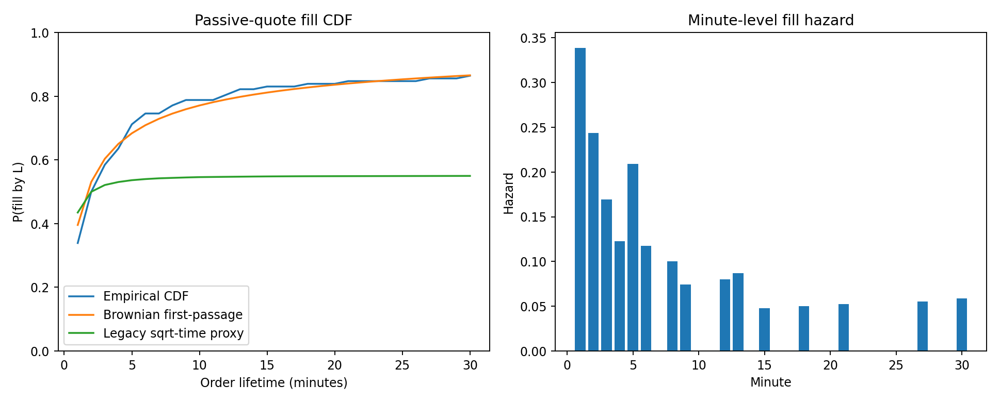
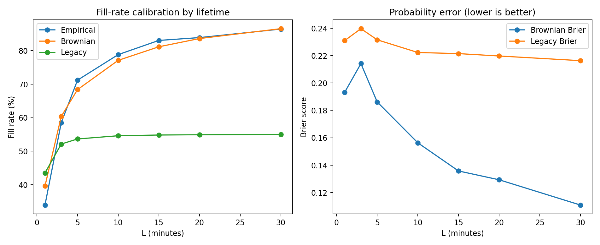
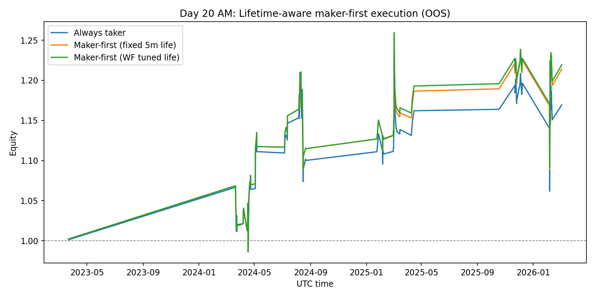

# Day 20 (AM): Time-to-Fill Is Front-Loaded — But Lifetime Tuning Is a Small Edge

Day 18 and Day 19 made one thing obvious: for this BTC funding-regime signal, execution assumptions dominate PnL.

Today I focused on a specific gap in the model:

> We were using a single expected fill probability. Real execution is a **time-to-fill distribution** problem.

So I rebuilt the maker-first module around minute-level fill timing.

---

## Setup (signal unchanged, execution model upgraded)

- Instrument: **BTCUSDT perpetual (Binance mark price)**
- Signal + walk-forward protocol: unchanged from Day 16–19
  - Funding z-score trigger + volatility gate
  - Expanding yearly OOS (test years 2023–2026)
- OOS selected trades: **118**
- Passive quote distance: **6 bps** below entry reference for long signal
- Candidate order lifetimes: **1, 3, 5, 10, 15, 20, 30 min**

For each signal timestamp, I pulled 1-minute bars and measured first-touch time to the passive quote.

---

## The math

Let \(\tau\) be first fill time (in minutes) for a passive quote.

CDF and survival:

$$
F(L)=\Pr(\tau \le L), \qquad S(L)=1-F(L)
$$

Expected return for a maker-first-then-chase policy with lifetime \(L\):

$$
\mathbb{E}[r(L)] = F(L)\,r_{\text{fill}} + \big(1-F(L)\big)\,r_{\text{chase}}(L)
$$

where:
- \(r_{\text{fill}}\): return if quote fills before \(L\)
- \(r_{\text{chase}}(L)\): return if unfilled by \(L\), then cross the spread at minute \(L\)

I compared two models for \(F(L)\):

1. **Legacy Day-18 proxy** (sqrt-time range scaling)
2. **Brownian first-passage approximation**

$$
\Pr(\tau \le L) \approx \operatorname{erfc}\!\left(\frac{\delta}{\sigma\sqrt{2L}}\right)
$$

with \(\delta\)=quote distance and \(\sigma\)=pre-entry 1-minute realized vol.

---

## Result 1: fills are heavily front-loaded



Empirical fill CDF on the 118 OOS trades:

- **33.9%** filled within 1 minute
- **58.5%** within 3 minutes
- **71.2%** within 5 minutes
- **86.4%** within 30 minutes
- Median fill time (conditional on filling): **2.0 min**
- 90th percentile fill time: **8.9 min**

Interpretation: if you don’t fill quickly, you are usually in the long tail.

---

## Result 2: Brownian approximation calibrated much better than legacy proxy



At every tested lifetime, Brownian probabilities were closer to empirical than the legacy proxy.

Example snapshots:

- **L=5 min**
  - Empirical: 71.2%
  - Brownian: 68.4% (Brier 0.186)
  - Legacy: 53.6% (Brier 0.232)

- **L=30 min**
  - Empirical: 86.4%
  - Brownian: 86.6% (Brier 0.111)
  - Legacy: 55.0% (Brier 0.216)

So the old proxy is materially underfilling at medium/long lifetimes.

---

## Result 3: walk-forward lifetime tuning helps, but only slightly

I ran a yearly walk-forward policy:
- pick best lifetime \(L\) on prior years only
- apply to current test year

Selections:
- 2023: fallback 5m (low train data)
- 2024: fallback 5m
- 2025: 15m
- 2026: 15m

OOS summary:



| Strategy | Avg bps/trade | Final equity | 95% stationary-bootstrap CI (bps/trade) | P(mean > 0) |
|---|---:|---:|---:|---:|
| Always taker | +15.28 | 1.169x | [-13.55, +42.35] | 86.2% |
| Maker-first fixed 5m | +18.44 | 1.214x | [-9.65, +45.98] | 90.0% |
| Maker-first WF tuned life | +18.85 | 1.219x | [-9.74, +45.70] | 89.8% |

The gain from WF lifetime tuning vs fixed 5m is only **+0.41 bps/trade**.

That is directionally positive, but not a regime change.

---

## Honest interpretation

1. **Distribution modeling is worth it.**
   The calibration win (Brownian vs legacy) is real.

2. **Most value is in getting first few minutes right.**
   Fill hazard decays quickly after early minutes.

3. **Lifetime tuning alone is not enough.**
   It improves expectancy a bit, but confidence intervals still overlap zero.

4. **This remains non-deployable without deeper microstructure realism.**

---

## Important limitations

This is still a simplified execution model:

- Mark-price 1m bars, not L2 queue/event data
- Touch-to-fill assumption ignores true queue position and partial fills
- No explicit adverse-selection penalty conditional on fill event
- No exchange-level order-book simulation

So treat these numbers as **research diagnostics**, not production estimates.

---

## Reproducibility

Files in this folder:

- `analyze_time_to_fill_distribution.py`
- `day20-am-time-to-fill-results.json`
- `day20-am-filltime-cdf.png`
- `day20-am-fill-calibration.png`
- `day20-am-lifetime-equity.png`

Run:

```bash
python3 blog/posts/2026-03-05-time-to-fill-distribution/analyze_time_to_fill_distribution.py
```

---

## Next step

Day 20 PM planned test:

> Make quote distance \(\delta\) dynamic with volatility state, then combine with the time-to-fill model.

If lifetime tuning is a second-order gain, quote placement is probably first-order.

---

## References

- Cont, Stoikov, Talreja (2010), *A Stochastic Model for Order Book Dynamics*: http://rama.cont.perso.math.cnrs.fr/pdf/CST2010.pdf
- Yu et al. (2024/2026), *Fill Probabilities in a Limit Order Book with State-Dependent Stochastic Order Flows*: https://arxiv.org/abs/2403.02572
- First-passage-time background (overview): https://en.wikipedia.org/wiki/First-hitting-time_model
- Politis & Romano (1994), *The Stationary Bootstrap*: https://www.tandfonline.com/doi/abs/10.1080/01621459.1994.10476870

*Research only. Not financial advice.*
