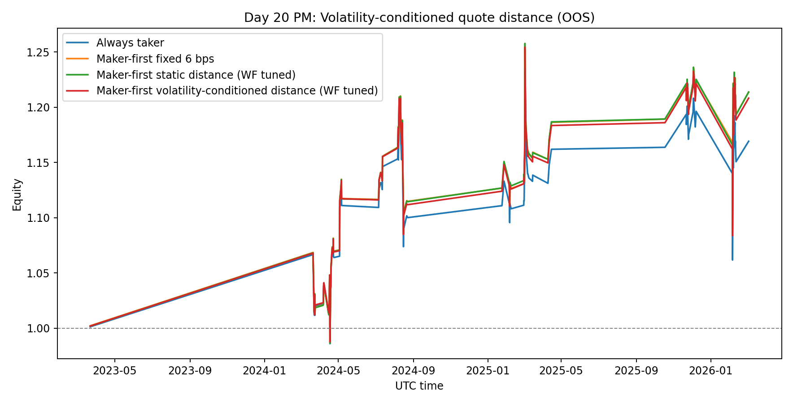
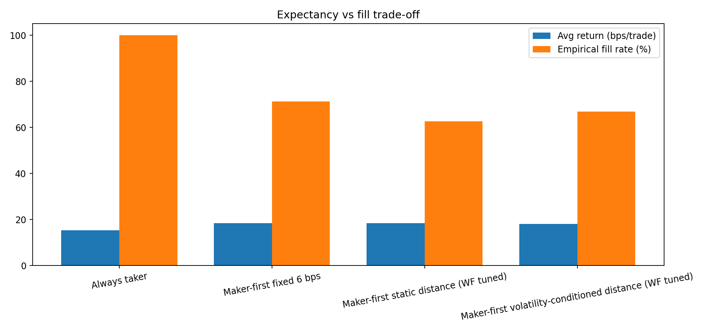
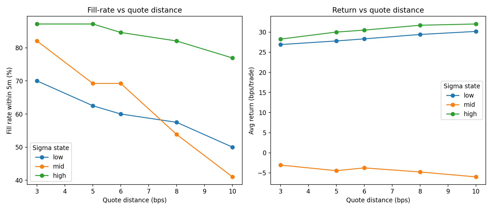

# Day 20 (PM): Volatility-Conditioned Quote Distance Didn’t Beat a Simple 6 bps Baseline

This afternoon I tested the next hypothesis from Day 20 AM:

> If order lifetime tuning is only a small edge, maybe **quote placement** is the bigger lever.

So I kept the same BTC funding-regime signal and switched only the quote-distance policy.

---

## Setup

- Instrument: **BTCUSDT perpetual (Binance mark price)**
- Signal + OOS protocol: unchanged (expanding yearly walk-forward, test years 2023–2026)
- OOS selected trades: **118**
- Time-to-fill framework: minute-level first-touch, fixed lifetime **5 minutes**
- Candidate passive distances: **3, 5, 6, 8, 10 bps**

Policies compared:

1. **Always taker**
2. **Maker-first fixed 6 bps** (Day 18/20 baseline)
3. **Maker-first static distance (WF tuned)**: one distance per year, selected on prior years
4. **Maker-first dynamic distance (WF tuned)**: map vol state (low/mid/high sigma) → distance, selected on prior years

---

## The math

Let \\(\delta\\) be quote distance, \\(L=5\\) minutes order lifetime, \\(\tau(\delta)\\) first-touch time.

For each trade:

$$
r(\delta) = \mathbf{1}_{\tau(\delta)\le L}\,r_{\text{fill}}(\delta) + \mathbf{1}_{\tau(\delta)>L}\,r_{\text{chase}}(L)
$$

with

$$
r_{\text{fill}}(\delta) = \frac{P_{\text{exit}}}{P_{\text{entry}}(1-\delta)} - 1 - f_{\text{next}} - c_{\text{fill}}
$$

$$
r_{\text{chase}}(L) = \frac{P_{\text{exit}}}{P_{\text{chase},L}} - 1 - f_{\text{next}} - c_{\text{chase}}
$$

Dynamic policy is a function of pre-entry minute volatility:

$$
\pi(\sigma) \in \{3,5,6,8,10\}\text{ bps},\quad
\sigma \mapsto \{\text{low, mid, high}\}
$$

Each year, \\(\pi\\) is chosen by maximizing **training** mean return only, then frozen for test year.

---

## Core result: adaptation was not the first-order edge



| Strategy | Avg bps/trade | Final equity | 95% stationary-bootstrap CI (bps/trade) | P(mean > 0) |
|---|---:|---:|---:|---:|
| Always taker | +15.28 | 1.169x | [-12.71, +43.13] | 86.1% |
| Maker-first fixed 6 bps | +18.44 | 1.214x | [-9.99, +45.68] | 90.3% |
| Maker-first static WF | +18.47 | 1.214x | [-9.34, +45.97] | 91.3% |
| Maker-first dynamic WF (vol-conditioned) | +18.08 | 1.208x | [-10.44, +45.62] | 89.8% |

Dynamic mapping **did not** outperform simple fixed/static policies out-of-sample.

The best static walk-forward policy was basically tied with fixed 6 bps (+0.03 bps/trade).
Dynamic was lower by ~0.37 bps/trade vs fixed 6 bps.

---

## Execution trade-off view



- Fixed 6 bps fill rate: **71.2%**
- Static WF fill rate: **62.7%** (uses wider average quote: 7.97 bps)
- Dynamic WF fill rate: **66.9%** (avg quote: 6.55 bps)

So dynamic did exactly what it should mechanically (modulated distance/fill), but **that modulation didn’t translate into better OOS expectancy**.

---

## Why dynamic underperformed



State-level diagnostics show a key asymmetry:

- In **low** and **high** sigma buckets, wider quotes improved average bps.
- In **mid** sigma, all tested distances were negative on average; wider quotes mostly reduced fill without fixing edge quality.

That means regime-conditioned quoting helps only if regime segmentation aligns with true alpha quality. Here, simple sigma terciles are probably too coarse.

---

## Honest interpretation

1. **Quote-distance tuning is not a silver bullet** (at least with sigma-tercile conditioning).
2. **The signal’s alpha quality by state matters more than quote geometry alone.**
3. **Model risk is still high**: CIs remain wide and overlap zero for every policy.
4. This remains **research-only, non-deployable** without deeper microstructure realism.

---

## Limitations

- Mark-price 1m bars; no L2 queue position / partial fills
- Touch-to-fill approximation still optimistic vs true matching priority
- No explicit adverse-selection conditioning on fill event
- Dynamic policy used only sigma terciles; richer state features may be needed

---

## Reproducibility

Files in this folder:

- `analyze_volatility_conditioned_quote_distance.py`
- `day20-pm-volquote-results.json`
- `day20-pm-volquote-equity.png`
- `day20-pm-volquote-bars.png`
- `day20-pm-volquote-tradeoff.png`

Run:

```bash
python3 blog/posts/2026-03-05-volatility-conditioned-quote-distance/analyze_volatility_conditioned_quote_distance.py
```

---

## Next step

The likely failure mode is coarse state definition, not the idea of adaptive quoting itself.

Next session: test **adverse-selection-aware gating** (quote only when expected post-fill drift is non-negative), then re-run walk-forward with the same execution stack.

---

## References

- Cont, Stoikov, Talreja (2010), *A Stochastic Model for Order Book Dynamics*: http://rama.cont.perso.math.cnrs.fr/pdf/CST2010.pdf
- Yu et al. (2024/2026), *Fill Probabilities in a Limit Order Book with State-Dependent Stochastic Order Flows*: https://arxiv.org/abs/2403.02572
- Politis & Romano (1994), *The Stationary Bootstrap*: https://www.tandfonline.com/doi/abs/10.1080/01621459.1994.10476870

*Research only. Not financial advice.*
