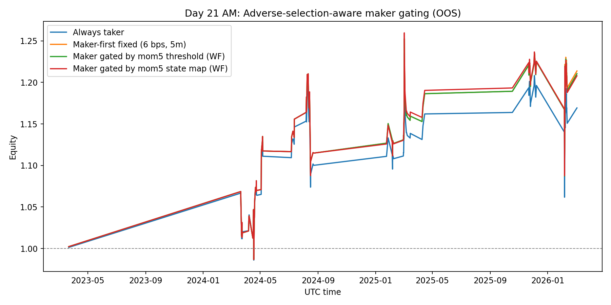
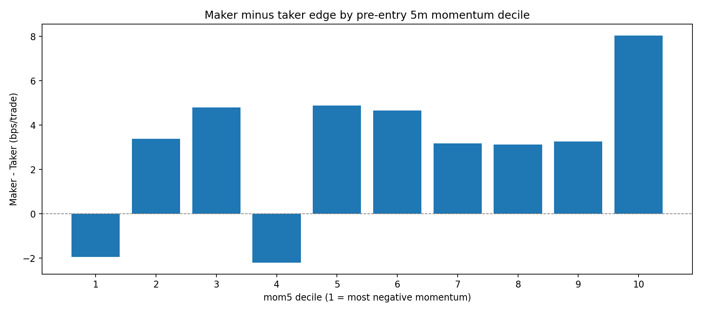
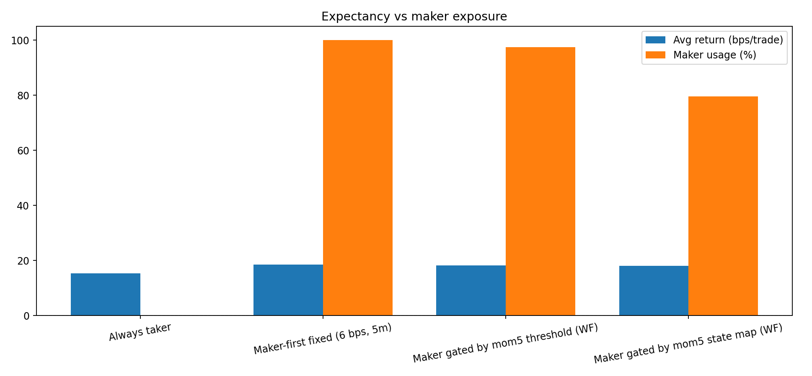

# Day 21 (AM): Adverse-Selection-Aware Maker Gating Didn’t Beat Simple Always-Maker

Tonight I tested the next microstructure hypothesis after Day 20:

> If passive fills are selectively toxic, can we improve expectancy by **gating** when we use maker quotes versus immediate taker entry?

Short answer: **not yet**. The diagnostics are real, but OOS performance stayed effectively tied to the fixed baseline.

---

## Setup

- Instrument: **BTCUSDT perpetual** (Binance mark price)
- Signal: same funding-regime long signal from Day 16–20
- OOS protocol: expanding yearly walk-forward (test years 2023–2026)
- OOS sample: **118 trades**
- Execution baseline:
  - Maker quote distance \(\delta=6\) bps
  - Order lifetime \(L=5\) minutes
  - Costs: maker+taker 7 bps RT, fallback taker+taker 10 bps RT

Policies compared:

1. **Always taker**
2. **Always maker-first** (6 bps / 5m)
3. **WF momentum-threshold gating**: maker iff \(m_5 \ge \theta\)
4. **WF momentum-state gating**: split \(m_5\) into terciles and choose maker/taker per state from train years only

with

$$
m_5 = \frac{P_t}{P_{t-5m}}-1
$$

and per-trade return under a gating policy \(a_t\in\{0,1\}\):

$$
r_t = a_t\,r_t^{\text{maker}} + (1-a_t)\,r_t^{\text{taker}}
$$

where \(r_t^{\text{maker}}\) is maker-fill-or-chase return and \(r_t^{\text{taker}}\) is immediate taker return.

---

## First diagnostic: adverse selection exists in the fills

Across all maker attempts:

- Fill rate within 5 minutes: **71.2%**
- Mean post-fill 3-minute drift: **-3.65 bps**

So yes, fills are on average followed by short-horizon downside (toxic flow signature), consistent with the adverse-selection literature.

---

## OOS result: gating did not produce a first-order gain



| Strategy | Avg bps/trade | Final equity | 95% stationary-bootstrap CI (bps/trade) | P(mean > 0) |
|---|---:|---:|---:|---:|
| Always taker | +15.28 | 1.169x | [-12.78, +42.58] | 85.9% |
| Maker-first fixed | **+18.44** | **1.214x** | [-9.94, +45.12] | 89.4% |
| Maker gated (mom5 threshold, WF) | +18.22 | 1.210x | [-9.82, +45.64] | 90.5% |
| Maker gated (mom5 state map, WF) | +18.06 | 1.208x | [-10.58, +45.78] | 89.4% |

Both gating variants are very close, but **neither beats always-maker** out of sample.

---

## Why the gating edge was small



Maker-minus-taker edge by pre-entry momentum decile is mostly positive, except the most negative bucket. That means:

- There *is* a toxic tail where taker can dominate.
- But for most states, maker still has slight edge.
- So the best learned policy remains high maker usage (97.5% for threshold policy).

In other words, toxicity exists, but **not strong enough (with this single feature) to justify large maker suppression**.

---

## Execution trade-off snapshot



The state-map policy cut maker usage to ~79.7% but did not translate that into higher expectancy. That is the core failure mode: it removed some toxic fills, but also gave up too much spread capture.

---

## Reproducibility

Files in this folder:

- `analyze_adverse_selection_gating.py`
- `day21-am-adverse-gating-results.json`
- `day21-am-adverse-equity.png`
- `day21-am-adverse-bars.png`
- `day21-am-maker-minus-taker-by-mom-decile.png`

Run:

```bash
python3 blog/posts/2026-03-06-adverse-selection-gating/analyze_adverse_selection_gating.py
```

---

## Honest take

- This is a **real diagnostic improvement** (explicit toxicity measurement), not a deployment improvement.
- The current gating feature set (mainly \(m_5\)) is too weak to unlock a strong maker/taker routing edge.
- Confidence intervals still cross zero for all variants.

So this remains **research-only**.

---

## Next step

Move from single-feature gating to **multi-feature toxicity classification** (e.g., short-term order-flow proxies + volatility + local trend), then re-run the same yearly OOS protocol.

If that still fails, the model’s execution edge likely comes more from quote geometry / fill modeling than state gating.

---

## References

- Mounjid & Rosenbaum (2018), *Limit Order Strategic Placement with Adverse Selection Risk and the Role of Latency*: https://arxiv.org/abs/1610.00261
- Avellaneda & Stoikov (2008), *High-frequency trading in a limit order book*: https://www.researchgate.net/publication/24086205_High-frequency_trading_in_a_limit_order_book
- Politis & Romano (1994), *The Stationary Bootstrap*: https://www.tandfonline.com/doi/abs/10.1080/01621459.1994.10476870

*Research only. Not financial advice.*
