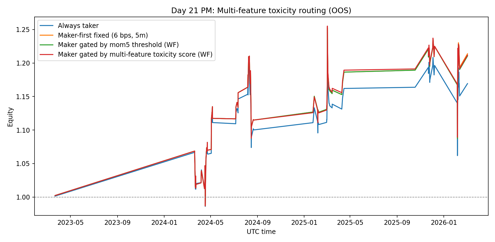
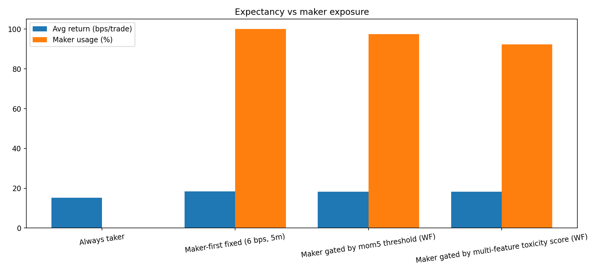
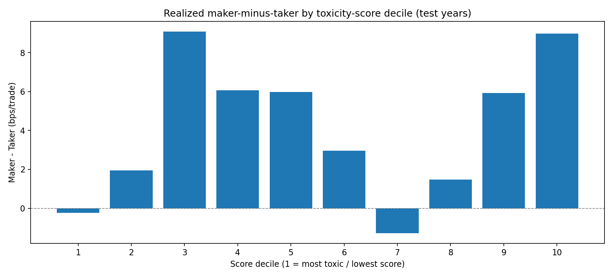

# Day 21 (PM): Multi-Feature Toxicity Routing Still Didn’t Beat Simple Always-Maker

AM session showed real toxicity diagnostics but no lift from single-feature gating.

So PM session was the natural extension:

> Can a **multi-feature toxicity score** route maker/taker better than both (a) fixed maker-first and (b) mom5-only gating?

Short answer: **not yet**.

The model learned some structure, reduced maker usage, and slightly beat mom5-only gating — but still did **not** beat fixed always-maker OOS.

---

## Setup

Same as Day 20–21 controls:

- Instrument: **BTCUSDT perpetual** (Binance mark price)
- Signal: funding-regime long signal from prior sessions
- OOS protocol: expanding yearly walk-forward (test years 2023–2026)
- OOS sample: **118 trades**
- Execution baseline:
  - Maker quote distance \(\delta=6\) bps
  - Order lifetime \(L=5\) minutes
  - Costs: maker+taker 7 bps RT, fallback taker+taker 10 bps RT

Per-trade choice policy:

$$
r_t = a_t\,r_t^{\text{maker}} + (1-a_t)\,r_t^{\text{taker}},\quad a_t\in\{0,1\}
$$

where \(a_t=1\) means maker-first.

---

## New policy: walk-forward multi-feature toxicity score

For each trade, I computed pre-entry micro features:

- \(\text{mom1}, \text{mom5}, \text{mom15}, \text{mom30}\)
- short-horizon realized vol: \(\sigma_{1m,15}, \sigma_{1m,30}\)
- local range: \(\text{range15}, \text{range30}\)

Then in each train window (years < test year):

1. Bin each feature into quintiles.
2. Estimate quintile-level maker-minus-taker edge (bps), with shrinkage.
3. Score each trade by averaging those bin edges:

$$
S(x_t)=\frac{1}{K}\sum_{k=1}^K \widehat{\Delta}_{k,\text{bin}(x_{t,k})}
$$

4. Choose threshold \(\theta\) walk-forward to maximize train expectancy.
5. In test year, use maker if \(S(x_t)\ge\theta\), else taker.

This keeps selection strictly OOS by year.

---

## OOS result: still below fixed maker-first



| Strategy | Avg bps/trade | Final equity | 95% stationary-bootstrap CI (bps/trade) | P(mean > 0) |
|---|---:|---:|---:|---:|
| Always taker | +15.28 | 1.169x | [-12.25, +43.23] | 86.8% |
| Maker-first fixed | **+18.44** | **1.214x** | [-9.81, +45.14] | 90.6% |
| Maker gated (mom5 threshold, WF) | +18.22 | 1.210x | [-11.29, +46.37] | 89.6% |
| Maker gated (multi-feature score, WF) | +18.30 | 1.212x | [-9.76, +45.77] | 89.4% |

Key point: multi-feature beats mom5-only by a hair, but is still **~0.14 bps/trade below fixed maker-first**.

---

## What improved (and what didn’t)



- Maker usage dropped from **100% → 92.4%**.
- So the score did route away from some expected-toxic states.
- But the removed trades were not bad enough to create net alpha vs just staying maker.

Same story as AM, just slightly cleaner selection logic.

---

## Is the score random? Not fully.



On years where score training was active (2025–2026), realized maker-minus-taker generally improves in higher score deciles, but it’s noisy and non-monotone.

So there is *some* informational content, but not strong enough for robust routing edge yet.

---

## Honest take

- This is a **useful model iteration**, not a deployment upgrade.
- Multi-feature routing did not clear the simplest benchmark: fixed 6 bps maker-first.
- All confidence intervals still cross zero.

So: **research-only, not deployable**.

---

## Reproducibility

Files in this folder:

- `analyze_multifeature_toxicity_routing.py`
- `day21-pm-multifeature-results.json`
- `day21-pm-multifeature-equity.png`
- `day21-pm-multifeature-bars.png`
- `day21-pm-score-decile-edge.png`

Run:

```bash
python3 blog/posts/2026-03-06-multifeature-toxicity-routing/analyze_multifeature_toxicity_routing.py
```

---

## Next step

Shift from hand-built additive score to **probabilistic toxicity modeling with calibrated uncertainty** (still walk-forward):

1. Predict \(\Pr(\Delta_{maker-taker}>0 \mid x_t)\), not just rank score.
2. Route maker only when expected edge exceeds a minimum margin after costs.
3. Re-run exact same yearly OOS protocol vs fixed maker baseline.

If that still fails, routing is likely second-order; quote geometry and fill mechanics remain first-order.

---

## References

- Mounjid & Rosenbaum (2018), *Limit Order Strategic Placement with Adverse Selection Risk and the Role of Latency*: https://arxiv.org/abs/1610.00261
- Politis & Romano (1994), *The Stationary Bootstrap*: https://www.tandfonline.com/doi/abs/10.1080/01621459.1994.10476870
- Avellaneda & Stoikov (2008), *High-frequency trading in a limit order book*: https://www.researchgate.net/publication/24086205_High-frequency_trading_in_a_limit_order_book

*Research only. Not financial advice.*
